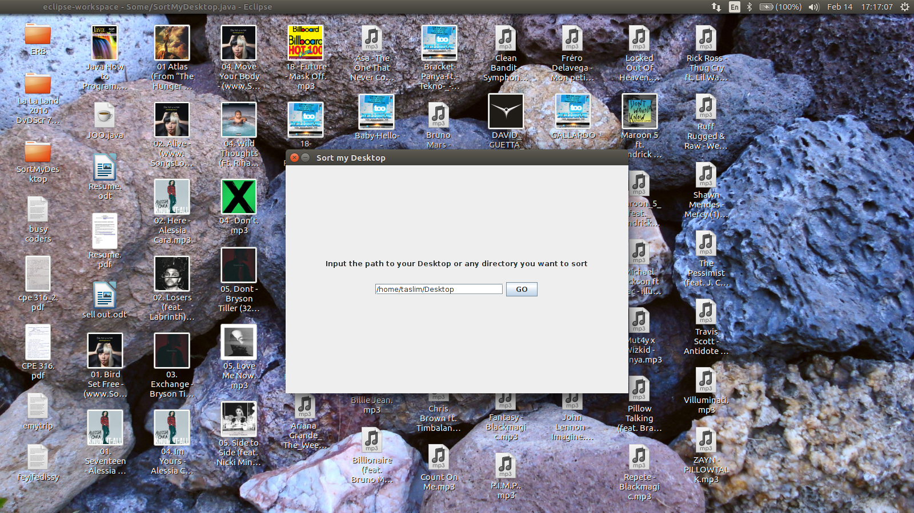
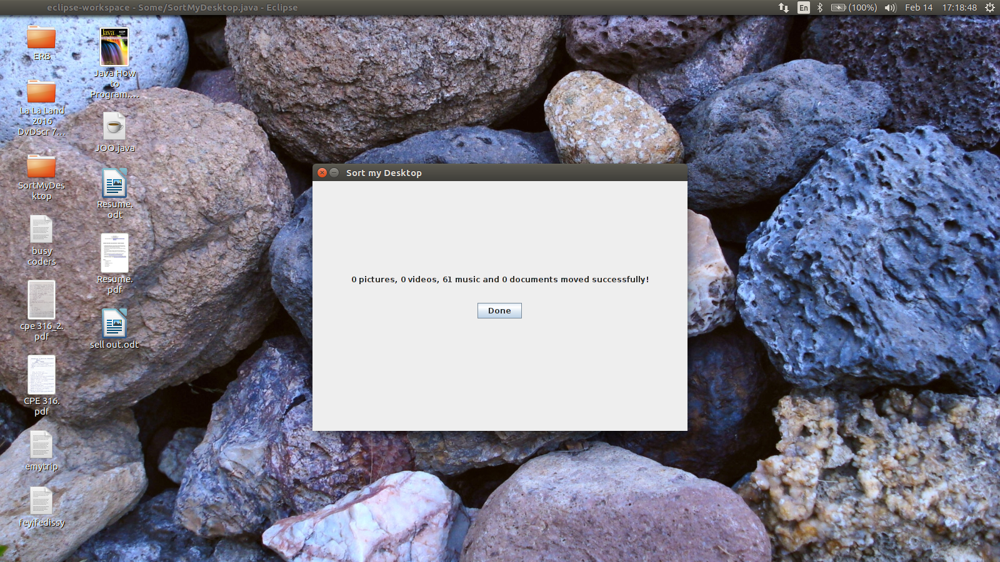

# Desktop Sorter

A Java application that helps sort your Desktop or any other specified directory.

### Author: Taslim Oseni

### About:

* written in: Java [JavaSE-1.8]

* IDE used: Eclipse

### Installation:

* Download, compile and run the .java file

### Preview:

  
  

  

  

  

  

### To do:
* Improve UI
* Add more file extension support
* Create a downloadable .exe version of the project

### Issues:
* null
